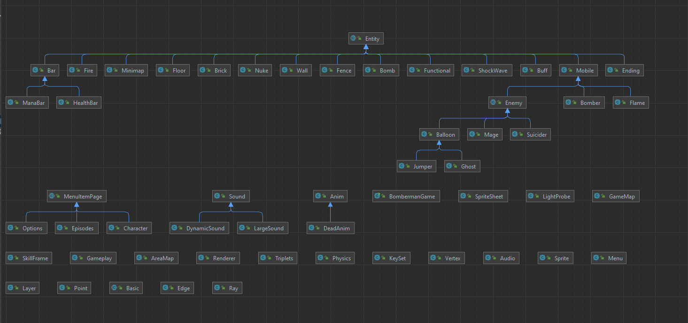

# Bài tập lớn OOP - Bomberman Game
## **Nhóm 8.**

## **Mục lục**
1. [Thành viên]
1. [Giới thiệu]
3. [Mô tả về các đối tượng trong trò chơi]
4. [Controls and Options]
5. [Chức năng đã làm theo yêu cầu]
6. [Chức năng làm thêm]
7. [UML Diagram]
8. [Demo]

## **1. Thành viên**
### **Họ và tên: Vũ Quý Đạt**
*MSV 21020106*
### **Họ và tên: Nguyễn Tuấn Hưng**
*MSV 21020205*
### **Họ và tên: Nguyễn Văn Hùng**
*MSV 21021504*
## **2. Giới thiệu**
Trong bài tập lớn này là viết một phiên bản mới Java dựa theo trò chơi [Bomberman] kinh điển của NES.
- 

## **3. Mô tả về các đối tượng trong trò chơi**
Nếu bạn đã từng chơi Bomberman, bạn sẽ cảm thấy quen thuộc với những đối tượng này.
Nhân vật sẽ có 6 kĩ năng trong đó có 3 kĩ năng chính, 1 chiêu cuối và 2 kĩ năng bổ trợ
*Hãy thiết kế hệ thống các đối tượng một cách phù hợp để tận dụng tối đa sức mạnh của OOP: tái sử dụng code, dễ dàng maintain.*

- *Bomber* là nhân vật chính của trò chơi. Bomber có thể di chuyển theo 4 hướng trái/phải/lên/xuống theo sự điều khiển của người chơi.

- *Enemy* là các đối tượng mà Bomber phải tiêu diệt hết để có thể qua Level. Enemy có thể di chuyển ngẫu nhiên hoặc tự đuổi theo Bomber tùy theo loại Enemy. Các loại Enemy sẽ được mô tả cụ thể ở phần dưới.

- *Bomb* là đối tượng mà Bomber sẽ đặt tại các ô Grass. Khi đã được kích hoạt, Bomber và Enemy không thể di chuyển vào vị trí Bomb. Tuy nhiên ngay khi Bomber vừa đặt và kích hoạt Bomb tại ví trí của mình, Bomber có một lần được đi từ vị trí đặt Bomb ra vị trí bên cạnh. Sau khi kích hoạt, Bomb sẽ tự nổ, các đối tượng *Flame*  được tạo ra.

- *Grass* là đối tượng mà Bomber và Enemy có thể di chuyển xuyên qua, và cho phép đặt Bomb lên vị trí của nó

- *Wall* là đối tượng cố định, không thể phá hủy bằng Bomb cũng như không thể đặt Bomb lên được, Bomber và Enemy không thể di chuyển vào đối tượng này

- *Brick* là đối tượng được đặt lên các ô Grass, không cho phép đặt Bomb lên nhưng có thể bị phá hủy bởi Bomb được đặt gần đó. Bomber và Enemy thông thường không thể di chuyển vào vị trí Brick khi nó chưa bị phá hủy.

- *Portal* là 1 cái cổng . Khi tất cả kẻ địch trong màn bị tiêu diệt thì cổng sẽ biến mất và nhân vật có thể di chuyển qua.

 
Các *Item* Bomber có thể sử dụng Item bằng cách di chuyển vào vị trí của Item. Thông tin về chức năng của các Item được liệt kê như dưới đây:
- *Buff kĩ năng* Khi sử dụng Item này, Bomber sẽ được tăng sức mạnh kĩ năng một giá trị thích hợp.

-  *Vô hình* Khi sử dụng Item này giúp nhân vật tàng hình và không bị enemy nhìn thấy.

Có nhiều loại Enemy trong Bomberman, tuy nhiên trong phiên bản này chỉ cài đặt 6 loại enemy sau:

- *Balloom* là Enemy đơn giản nhất, di chuyển ngẫu nhiên với vận tốc cố định.

- *Suicidal* có di chuyển ngẫu nhiên với tốc độ nhanh hơn Balloom và di chuyển đến nhân vật và tự tử.

- *Gohst* có di chuyển ngẫu nhiên với tốc độ nhanh hơn Balloom và di chuyển được qua tường.

- *Jumper* là Enemy di chuyển "thông minh" hơn so với Balloom và nó sẽ nhảy thẳng tới để cắn bạn khi bạn ở trong tầm nhìn của nó.

-  *Mage* là Enemy đặc biệt nhất, nó sẽ dùng gậy và dùng kĩ năng của nó tới bạn và tạo ra lửa màu xanhxanh.

## Mô tả game play, xử lý va chạm và xử lý bom nổ
- Trong một màn chơi, Bomber sẽ được người chơi di chuyển vàsử dụng phù hợp 6 kĩ năng của nhân vật để đặt và kích hoạt Bomb với mục tiêu chính là tiêu diệt tất cả Enemy và tìm ra vị trí Portal để có thể qua màn mới

- Bomber sẽ bị giết khi va chạm với Enemy hoặc thuộc phạm vi Bomb nổ. Lúc đấy trò chơi kết thúc.

- Enemy bị tiêu diệt khi thuộc phạm vi Bomb nổ

- Một đối tượng thuộc phạm vi Bomb nổ có nghĩa là đối tượng đó va chạm với một trong các tia lửa được tạo ra tại thời điểm một đối tượng Bomb nổ.

- Khi các Flame xuất hiện, nếu có một đối tượng thuộc loại Brick/Wall nằm trên vị trí một trong các Flame thì độ dài Flame đó sẽ được giảm đi để sao cho Flame chỉ xuất hiện đến vị trí đối tượng Brick/Wall theo hướng xuất hiện. Lúc đó chỉ có đối tượng Brick/Wall bị ảnh hưởng bởi Flame, các đối tượng tiếp theo không bị ảnh hưởng. Còn nếu vật cản Flame là một đối tượng Bomb khác thì đối tượng Bomb đó cũng sẽ nổ ngay lập tức.

## **4. Controls and Options**

| Control | Key 1 |
|---------|-------|
| UP      | ↑     |
| DOWN    |  ↓    |
| LEFT    |  ←    |
| RIGHT   |  →    |

| Skill | Key  |
|------------|-------|
| Bomb       | Q     |
| Spit fire  |  W    |
| Invisible  |  E    |
| Super bomb |  R    |
| Flash      | D     |
| Health     | F     |
| Mini map   | M     |
| Enemy map  | Tab   |
| Change enemy in enemy map | T |
|Switch view of enemy | P |
 

## **5. Chức năng đã làm theo yêu cầu**
1. Thiết kế cây thừa kế cho các đối tượng game
2. Xây dựng bản đồ màn chơi từ tệp cấu hình.
3. Di chuyển Bomber theo sự điều khiển từ người chơi.
4. Tự động di chuyển các Enemy.
5. Xử lý va chạm cho các đối tượng Bomber, Enemy, Wall, Brick, Bomb.
6. Xử lý bom nổ.
7. Xử lý khi Bomber sử dụng các Item và khi đi vào vị trí Portal.

8. Nâng cấp thuật toán tìm đường cho Enemy.
9. Cài đặt thêm các loại Enemy khác.
10. Xử lý hiệu ứng âm thanh (thêm music & sound effects).

## **6. Chức năng làm thêm**
1. Tạo ra cách chơi độ đáo mới lạ.

2. Xây dựng nhiều màn chơi và mỗi màn lại có một đặc trưng riêng.

3. Xây dựng nhiều level cho game, mỗi level có các enemy khác nhau.

4. Làm menu bắt đầu chơi game, menu khi kết thúc game.

5. Cài đặt thêm nhiều loại Item khác.

6. Có nhiều nhân vật để chọn và chơi
- 
- 
## **8. UML Diagram**
- 

## **9. Demo**
Và để rõ hơn về game thì sau đây là video demo của game.
https://youtu.be/YXp9FSqQnzY
